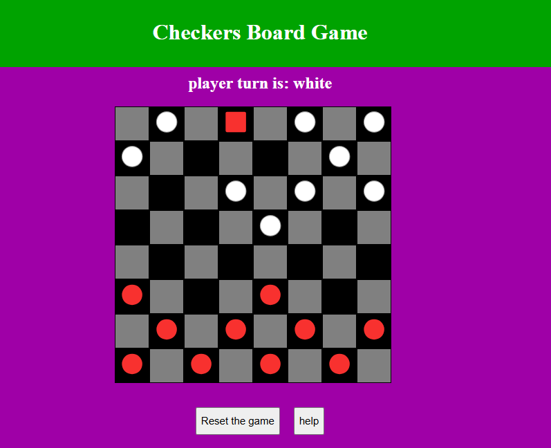

# Checker board game
Checker game is an old game use a board divided into 8x8 tiles, and use 24 stones 12 same color for each player as shown in the figure below.

The idea of the game is to captures the opponent stones by jumping over the stone. 

## Getting started:
to access the game press here [press here](https://aha1-lab.github.io/checker-board-game/)

To play this game two player required player1 and player2, the stone color can be change as you like.

## Technologies used

Software used to develop the game:
- HTML
- JavaScript
- CSS

## Next steps
The next step is to develop an AI agent to play the game with a single player.